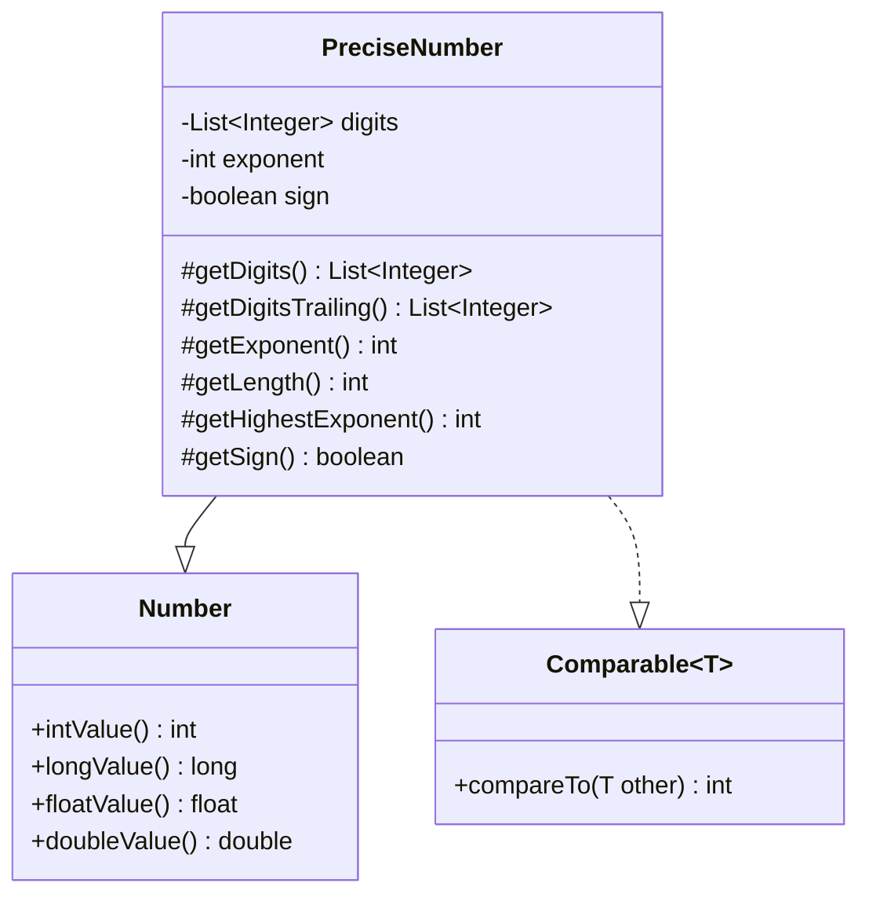

Precise number
==============

## What is this?
This is a library to provide a precise number in Java. This addresses the approximation errors of `double` and `float` numbers.

## The class diagram
